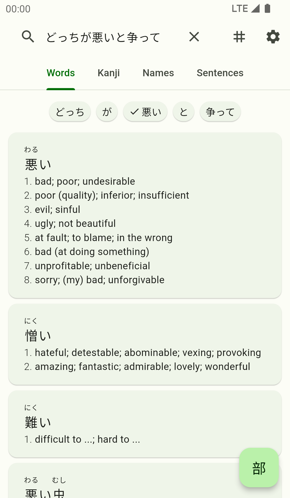
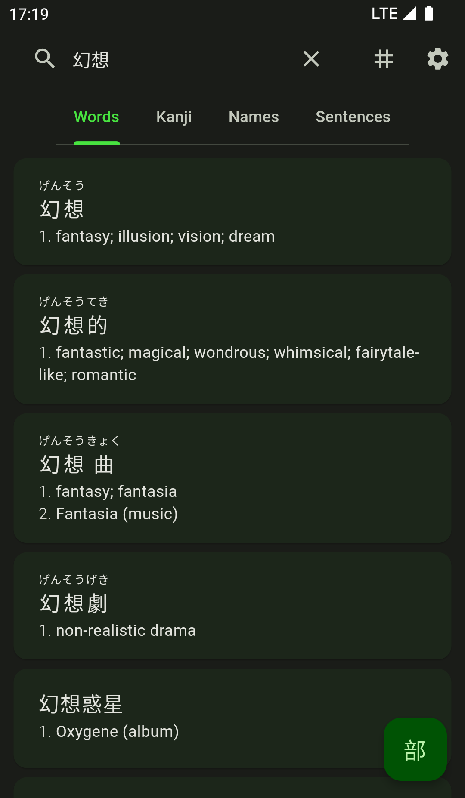
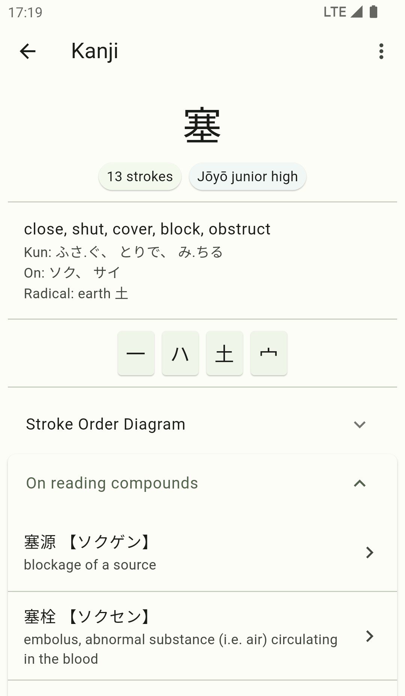
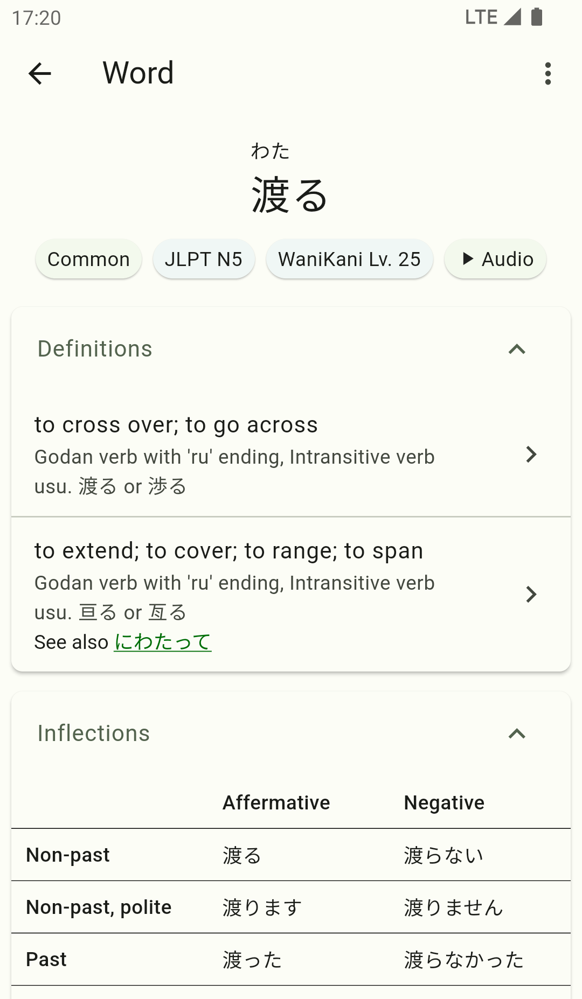
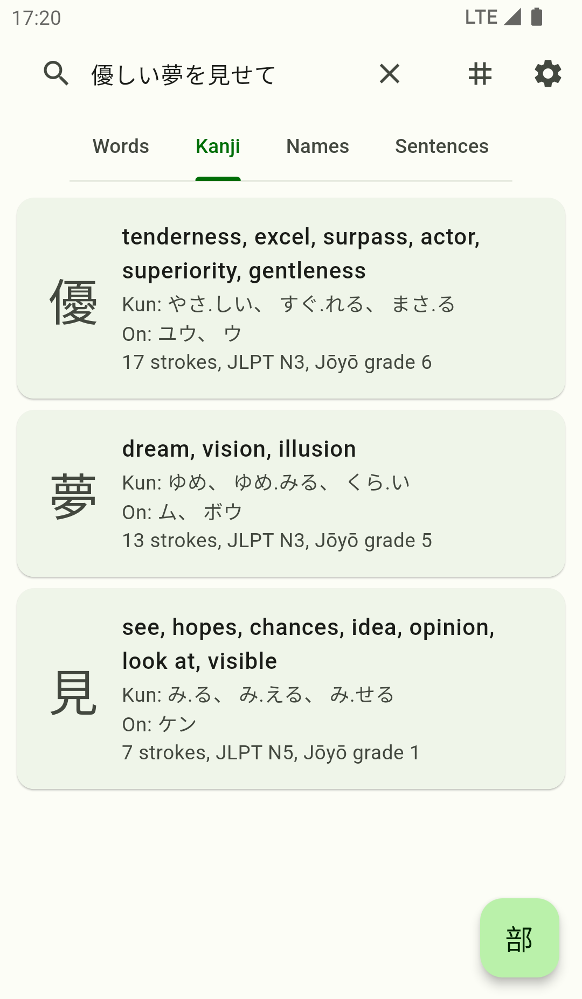
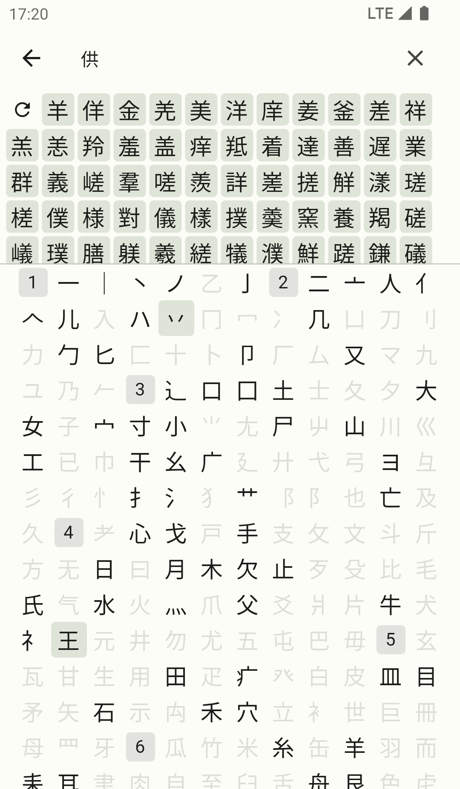
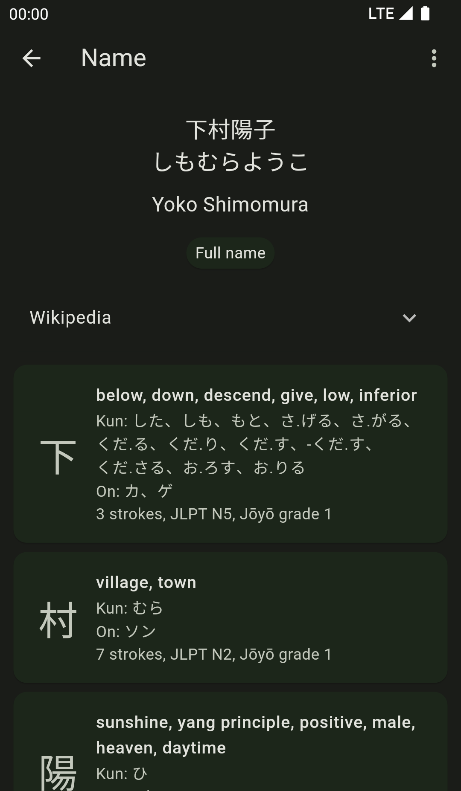

# **JS-Dict**

Japanese-English dictionary app powered by Jisho.org.

## Screenshots

## License

JS-Dict is Free Software: You can use, study, share, and improve it at will. Specifically you can redistribute and/or modify it under the terms of the [GNU General Public License version 3](https://www.gnu.org/licenses/gpl-3.0.en.html) as published by the Free Software Foundation.
